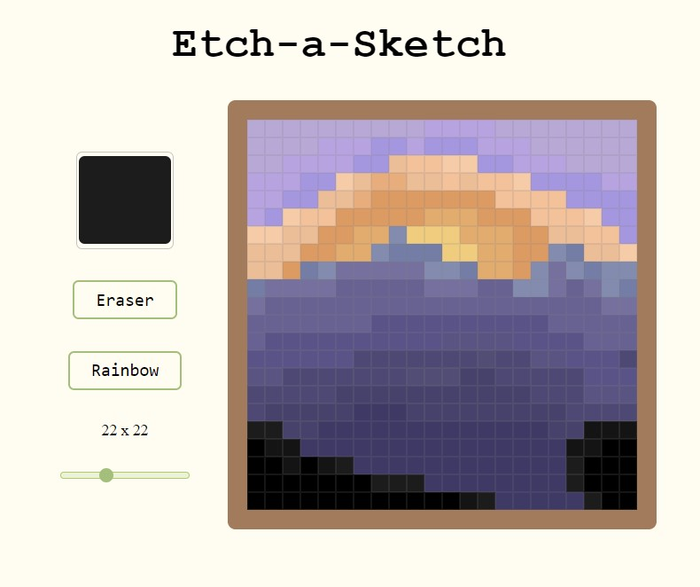

# Etch-a-Sketch

## About

Simple etch-a-sketch to practice javascript

## Functions

- Change the color using a color picker
- Erase pixels
- Rainbow paint
- Change the size of the canvas(1x1 - 64x64)

## Technologies Used

- HTML
- CSS
- Javascript